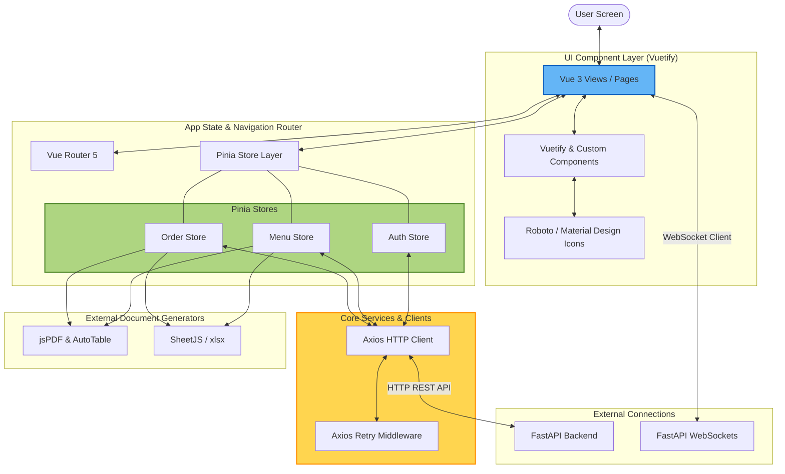

# FoodHub Frontend System Architecture & Design

This document details the frontend architecture, library adoption, and component layers of the **FoodHub Client Application** (Vue 3 + Vuetify + TypeScript).

---

## 1. Frontend Architectural Overview

The frontend is structured as a client-side Single Page Application (SPA) driven by Vue 3, using Pinia for centralized state management, Vue Router for view navigation, and Vuetify for the UI layout.

### Architectural Component Diagram

---

## 2. Directory Layout & Module Structure
The frontend project follows a modular file layout:
* **`src/main.ts`**: Application bootstrapper initializing Vue, Pinia, Vuetify, and Vue Router.
* **`src/plugins/`**: Configuration files for Vuetify, Axios, and font systems.
* **`src/router/`**: Defines application routes, path variables, and navigation guards (blocking non-authenticated staff from HR panels).
* **`src/stores/`**: Pinia state management stores containing async actions that fetch data from the API.
* **`src/views/`**: Complete page components (e.g., `Login.vue`, `Dashboard.vue`, `MenuManagement.vue`).
* **`src/components/`**: Modular, reusable UI components (e.g., buttons, meal cards, dialog prompts).

---

## 3. Adopted Tools & Libraries (Why They Were Chosen)

### ⚡ Core Framework & Compilation
1. **Vue 3 (Composition API)**:
   * **Role**: The foundational progressive framework.
   * **Why**: The Composition API (`<script setup>`) provides clean code organization, excellent TypeScript integration, and reactive state tracking.
2. **TypeScript**:
   * **Role**: Type safety.
   * **Why**: Prevents runtime errors by strictly typing incoming database structures (e.g. Menu DTOs, User profiles) and props.
3. **Vite**:
   * **Role**: Build tool and bundler.
   * **Why**: Extreme speed during local development (HMR) and optimized Rollup-based production builds.

### 🎨 User Interface (UI) & Style
4. **Vuetify 4**:
   * **Role**: Material Design component framework.
   * **Why**: Provides a collection of responsive, pre-designed UI elements (data tables, cards, dialog boxes, form inputs) out-of-the-box, saving development time.
5. **Sass (sass-embedded)**:
   * **Role**: Styling engine.
   * **Why**: Enables custom overriding of Vuetify's default design tokens and variables.
6. **Roboto Font & Material Design Icons (@mdi/font)**:
   * **Role**: Fonts and visual indicators.
   * **Why**: Standard Material Design typography and iconography.

### 🗃️ State Management & Routing
7. **Pinia 3**:
   * **Role**: Global state management.
   * **Why**: Replaces Vuex with a simpler, modular architecture. Stores keep track of active sessions, selected menu periods, and orders without prop-drilling.
8. **Vue Router 5**:
   * **Role**: Routing engine.
   * **Why**: Manages routes and route guards. Ensures users who are logged out are redirected to `/login`, and blocks staff members from opening HR administration pages.

### 🌐 Network & API Connection
9. **Axios & Axios Retry**:
   * **Role**: HTTP REST client.
   * **Why**: Simplifies JSON payload handling, request/response interceptors (for automatically appending the JWT Authorization header), and network transient-failure retry policies.

### 📄 Utility & File Exporting
10. **jsPDF & jsPDF-AutoTable**:
    * **Role**: Client-side PDF generator.
    * **Why**: Allows users to download clean, printable meal schedule layouts, rosters, and order receipts directly from their browser.
11. **SheetJS (xlsx)**:
    * **Role**: Spreadsheet exporter.
    * **Why**: Enables HR and operators to export menu sheets and order reports directly to Excel spreadsheets (`.xlsx`) for accounting.
